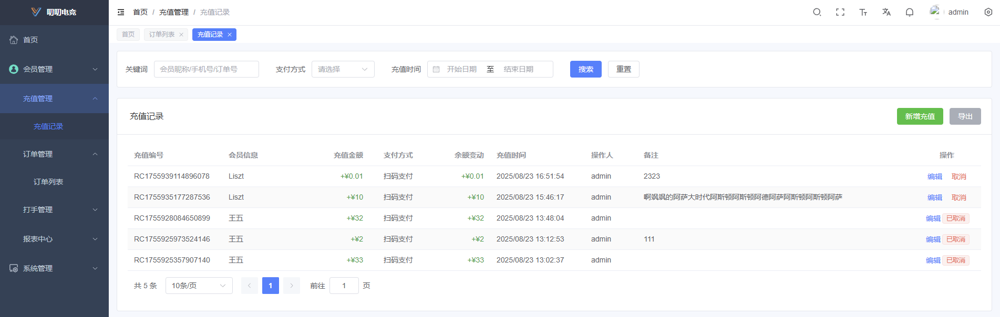
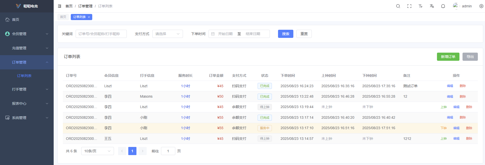
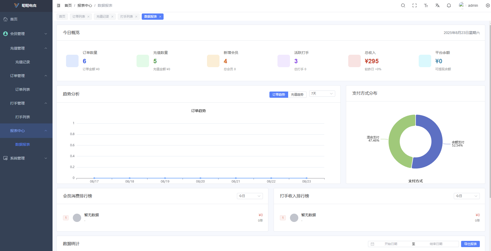
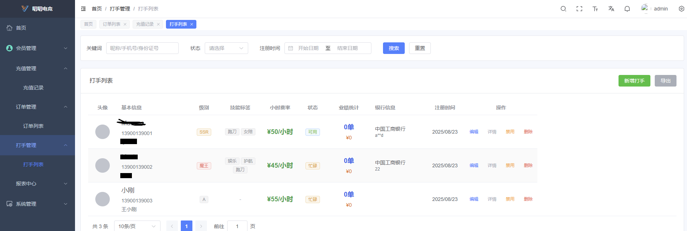

# 🎮 叨叨电竞 - 陪玩管理系统

> 基于 Vue3 + Node.js + TypeScript 的现代化陪玩业务管理系统

[](https://vuejs.org/)
[](https://www.typescriptlang.org/)
[](https://nodejs.org/)
[](LICENSE)

## 🖼️ 项目展示

<div align="center">
  
  
  <br />
  
  
</div>

## 🏆 叨叨电竞品牌介绍

**叨叨电竞** 是领先的三角洲陪玩俱乐部，致力于为用户提供专业、安全、便捷的陪玩服务体验。

我们拥有：

- 🎯 **专业陪玩师团队** - 经过严格筛选和培训的优质陪玩师
- 🛡️ **安全保障体系** - 实名认证、信用评级、投诉处理机制
- 💰 **灵活支付方式** - 支持多种支付渠道，资金安全有保障
- 📱 **便捷操作体验** - 简洁直观的界面设计，操作简单易上手
- 🔄 **7×24小时服务** - 全天候在线，随时满足您的陪玩需求


<div align="center">
  
</div>


## 📖 项目简介

叨叨电竞陪玩管理系统是一个专为陪玩业务设计的全栈管理系统，提供完整的陪玩业务流程管理，从用户注册到订单完成的全流程覆盖。系统采用前后端分离架构，具备现代化的用户界面和强大的后台管理能力。

### 🎯 核心功能

- **用户管理** - 用户注册、认证、等级管理、信用评级
- **陪玩师管理** - 陪玩师入驻、技能认证、接单管理、绩效统计
- **订单管理** - 陪玩订单创建、状态跟踪、支付处理、评价系统
- **财务管理** - 收入统计、分成计算、提现管理、财务报表
- **内容管理** - 游戏分类、技能标签、价格设置、活动管理
- **数据分析** - 业务数据统计、趋势分析、用户行为分析

## 🔄 业务流程

### 📋 完整陪玩业务流程

```
用户注册 → 身份认证 → 浏览陪玩师 → 选择服务 → 下单支付 → 陪玩服务 → 完成评价 → 结算分成
    ↓           ↓           ↓           ↓           ↓           ↓           ↓           ↓
  实名验证    信用评级    技能匹配    价格确认    资金托管    实时监控    质量反馈    收益分配
```

### 🎯 核心业务环节

1. **用户端流程**
   - 注册登录 → 身份认证 → 充值余额 → 选择陪玩师 → 下单支付 → 享受服务 → 评价反馈

2. **陪玩师端流程**
   - 入驻申请 → 技能认证 → 接单管理 → 提供服务 → 订单完成 → 收益结算 → 提现到账

3. **平台端流程**
   - 资质审核 → 质量监控 → 订单管理 → 资金托管 → 纠纷处理 → 数据分析 → 运营优化

## 🛠 技术栈

### 前端 (Frontend)
- **框架**: Vue 3.5.18 + TypeScript
- **构建工具**: Vite 6.0.1
- **UI 组件库**: Element Plus 2.10.5
- **状态管理**: Pinia 3.0.3
- **路由**: Vue Router 4.5.1
- **HTTP 客户端**: Axios 1.11.0
- **图表**: ECharts 5.6.0
- **代码规范**: ESLint + Prettier + Stylelint

### 后端 (Backend)
- **运行时**: Node.js 18+
- **框架**: Express 4.18.2 + TypeScript
- **数据库**: MySQL 8.0+
- **ORM**: Sequelize 6.35.2 + Sequelize-TypeScript
- **认证**: JWT + bcryptjs
- **验证**: Joi + express-validator
- **安全**: Helmet + CORS

### 开发工具
- **包管理器**: pnpm 10.15.0
- **并发运行**: concurrently 8.2.2
- **代码提交**: Husky + commitlint
- **数据库同步**: Sequelize CLI

## 🚀 快速开始

### 环境要求

- Node.js >= 18.0.0
- pnpm >= 8.0.0
- MySQL >= 8.0.0

### 安装依赖

```bash
# 克隆项目
git clone <repository-url>
cd daodao

# 安装所有依赖（根目录、后端、前端）
npm run install:all
```

### 环境配置

1. **后端环境变量** (`backend/.env`)
```env
# 数据库配置
DB_HOST=localhost
DB_PORT=3306
DB_USER=your_username
DB_PASSWORD=your_password
DB_NAME=daodao_gaming

# JWT 配置
JWT_SECRET=your_jwt_secret
JWT_EXPIRES_IN=24h

# 服务器配置
PORT=3000
NODE_ENV=development
```

2. **前端环境变量** (`frontend/.env`)
```env
# API 基础路径
VITE_MOD=http://localhost:3000/api

# 应用配置
VITE_APP_TITLE=叨叨电竞
VITE_APP_VERSION=3.3.1
```

### 数据库初始化

```bash
# 创建数据库
mysql -u root -p -e "CREATE DATABASE daodao_gaming CHARACTER SET utf8mb4 COLLATE utf8mb4_unicode_ci;"

# 同步数据库表结构
cd backend
npm run db:sync

# 执行数据库更新脚本（如果需要）
mysql -u root -p daodao_gaming < database_updates.sql
```

### 启动开发环境

```bash
# 同时启动前后端开发服务器
npm run dev:full
```

访问地址：
- 前端: http://localhost:5173
- 后端 API: http://localhost:3000

## 📁 项目结构

```
daodao/
├── frontend/                 # 前端项目
│   ├── src/
│   │   ├── api/             # API 接口
│   │   ├── assets/          # 静态资源
│   │   ├── components/      # 通用组件
│   │   ├── composables/     # Vue3 组合式函数
│   │   ├── constants/       # 常量定义
│   │   ├── directive/       # 自定义指令
│   │   ├── enums/          # 枚举定义
│   │   ├── layouts/        # 布局组件
│   │   ├── plugins/        # 插件配置
│   │   ├── router/         # 路由配置
│   │   ├── store/          # 状态管理
│   │   ├── styles/         # 样式文件
│   │   ├── types/          # TypeScript 类型
│   │   ├── utils/          # 工具函数
│   │   └── views/          # 页面组件
│   ├── public/             # 公共资源
│   └── package.json
├── backend/                 # 后端项目
│   ├── src/
│   │   ├── controllers/    # 控制器
│   │   ├── models/         # 数据模型
│   │   ├── routes/         # 路由定义
│   │   ├── services/       # 业务逻辑
│   │   ├── middleware/     # 中间件
│   │   ├── utils/          # 工具函数
│   │   └── app.ts          # 应用入口
│   ├── scripts/            # 数据库脚本
│   └── package.json
├── package.json            # 根目录配置
└── README.md
```

## 🎨 功能特性

### ✅ 已实现功能

#### 用户管理模块
- ✅ 用户注册登录系统
- ✅ 身份实名认证
- ✅ 用户等级管理
- ✅ 信用评级体系
- ✅ 用户行为分析

#### 陪玩师管理模块
- ✅ 陪玩师入驻申请
- ✅ 技能认证系统
- ✅ 接单状态管理
- ✅ 绩效统计分析
- ✅ 收入明细查询

#### 订单管理模块
- ✅ 陪玩订单创建
- ✅ 订单状态跟踪
- ✅ 多种支付方式
- ✅ 订单评价系统
- ✅ 订单搜索筛选

#### 财务管理模块
- ✅ 收入统计报表
- ✅ 分成计算系统
- ✅ 提现申请管理
- ✅ 资金流水记录
- ✅ 财务报表导出

#### 内容管理模块
- ✅ 游戏分类管理
- ✅ 技能标签系统
- ✅ 价格设置管理
- ✅ 活动发布管理
- ✅ 内容审核流程

#### 数据分析模块
- ✅ 业务数据统计
- ✅ 趋势图表分析
- ✅ 用户行为分析
- ✅ 陪玩师排行榜
- ✅ 数据导出功能

### 🚧 后续开发计划

#### 第二期功能（预计2个月）
- 🔄 实时聊天系统
- 🔄 语音通话功能
- 🔄 视频直播集成
- 🔄 智能推荐算法
- 🔄 移动端APP开发

#### 第三期功能（预计3个月）
- 🔄 AI陪玩助手
- 🔄 多语言支持
- 🔄 国际化支付
- 🔄 区块链积分系统
- 🔄 社区互动功能

#### 第四期功能（预计4个月）
- 🔄 元宇宙陪玩空间
- 🔄 VR/AR陪玩体验
- 🔄 智能客服机器人
- 🔄 大数据风控系统
- 🔄 企业级API开放

## 🔧 开发命令

### 根目录命令
```bash
# 安装所有依赖
npm run install:all

# 同时启动前后端开发服务器
npm run dev:full

# 构建所有项目
npm run build:all
```

### 前端命令
```bash
cd frontend

# 启动开发服务器
pnpm dev

# 构建生产版本
pnpm build

# 代码检查
pnpm lint

# 类型检查
pnpm type-check
```

### 后端命令
```bash
cd backend

# 启动开发服务器
npm run dev

# 构建项目
npm run build

# 启动生产服务器
npm start

# 数据库同步
npm run db:sync
```

## 🎯 系统导航

```
后台首页（Dashboard）
│
├── 用户管理
│    ├── 用户列表
│    │    └── 用户详情页
│    │         ├── 认证信息
│    │         ├── 订单记录
│    │         └── 评价反馈
│    └── 新增/编辑用户表单
│
├── 陪玩师管理
│    ├── 陪玩师列表
│    │    └── 陪玩师详情页
│    │         ├── 技能认证
│    │         ├── 接单统计
│    │         └── 收入明细
│    └── 新增/编辑陪玩师表单
│
├── 订单管理
│    ├── 订单列表
│    │    └── 订单详情页
│    │         ├── 支付信息
│    │         ├── 服务记录
│    │         └── 评价反馈
│    └── 新增订单表单
│
├── 财务管理
│    ├── 收入统计
│    ├── 分成计算
│    ├── 提现管理
│    └── 财务报表
│
├── 内容管理
│    ├── 游戏分类
│    ├── 技能标签
│    ├── 价格设置
│    └── 活动管理
│
└── 数据分析
     ├── 业务概览
     ├── 趋势分析
     ├── 用户行为
     └── 排行榜
```

详细的导航结构请参考：[系统导航结构.md](系统导航结构.md)

## 🤝 贡献指南

1. Fork 本仓库
2. 创建特性分支 (`git checkout -b feature/AmazingFeature`)
3. 提交更改 (`git commit -m 'Add some AmazingFeature'`)
4. 推送到分支 (`git push origin feature/AmazingFeature`)
5. 开启 Pull Request

## 📝 代码规范

- 使用 ESLint + Prettier 进行代码格式化
- 遵循 TypeScript 严格模式
- 使用 Conventional Commits 规范
- 组件命名采用 PascalCase
- 文件命名采用 kebab-case

## 📄 许可证

本项目采用 MIT 许可证 - 查看 [LICENSE](LICENSE) 文件了解详情

## 📞 联系方式

- 项目维护者: 叨叨电竞团队
- 邮箱: admin@daodao.lol
- 官网: https://daodao.lol
- 项目地址: https://github.com/daodao-gaming/daodaochangyou

## 🙏 致谢

- [Vue.js](https://vuejs.org/) - 渐进式 JavaScript 框架
- [Element Plus](https://element-plus.org/) - Vue 3 组件库
- [Express](https://expressjs.com/) - Node.js Web 应用框架
- [Sequelize](https://sequelize.org/) - Node.js ORM

---

⭐ 如果这个项目对你有帮助，请给我们一个 Star！
